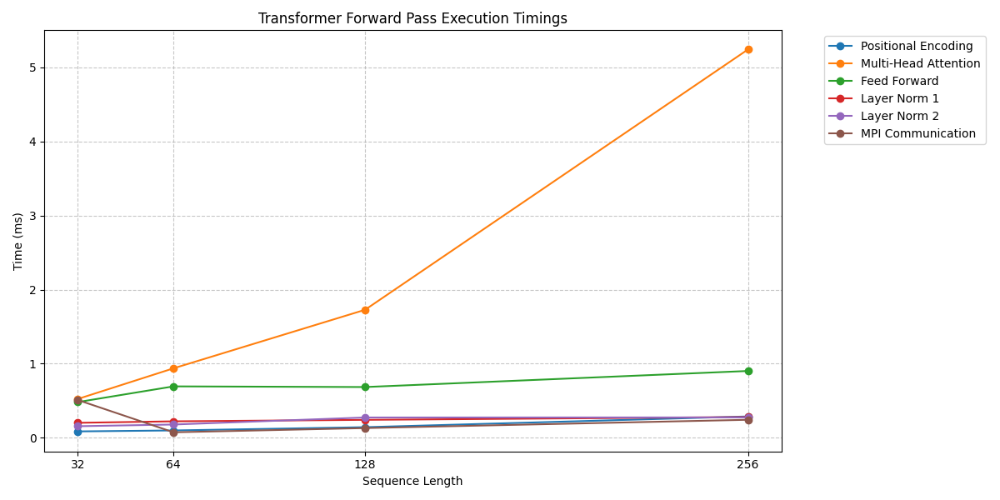

# csi596-project

```
g++ -o transformer transformer.cpp -std=c++11
```
```
./transformer   
```

## Background
Transformer models, and their multi-head attention mechanisms, have emerged as a powerful class of architectures for tasks in NLP and beyond. While these models demonstrate remarkable performance and flexibility, their computational demands can be substantial. This project focuses on the core computational kernel of the Transformer—the multi-head self-attention operation—and examines how different parallelization strategies affect performance. We begin with a naive CPU implementation that serves as a baseline, illustrating the computational steps of the attention kernel in a straightforward, single-threaded manner. We then introduce an MPI + OpenMP version that leverages distributed memory parallelism across multiple processes as well as shared-memory parallelism within each process. Finally, we develop a CUDA-accelerated GPU version that uses efficient GPU kernels and streams to exploit the massive parallelism of modern graphics processors. By comparing these three approaches, this project highlights the trade-offs in complexity, scalability, and speedup that emerge when moving from a simple CPU-only solution to more advanced parallelization strategies, ultimately guiding practitioners in selecting the most suitable optimization approach for their specific system and workload.


## Overview
1. **Naive CPU version:**  
   A single-core, non-optimized reference implementation.

2. **MPI + OpenMP parallelization:**  
   - **MPI:** Distribute the workload (e.g., different input batches or heads) across multiple compute nodes/processes.
   - **OpenMP:** Further parallelize computations within each MPI process across multiple CPU threads.

3. **CUDA GPU acceleration:**  
   Implement and optimize the key operations on GPUs to exploit massive parallelism, and use CUDA streams to parallelize computations across multiple heads.

This comparison will be accomplished by time performance data monitored by python scripts and the generated diagrams.

## Summary of Results



